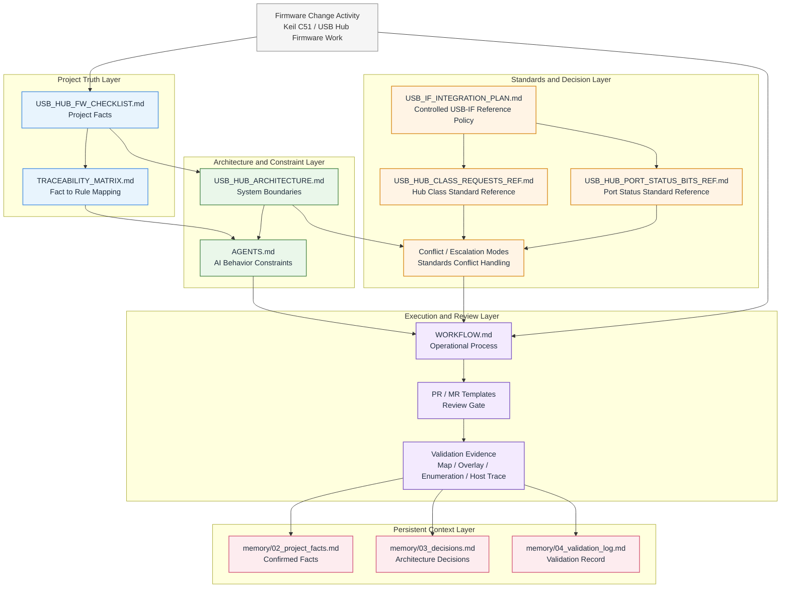
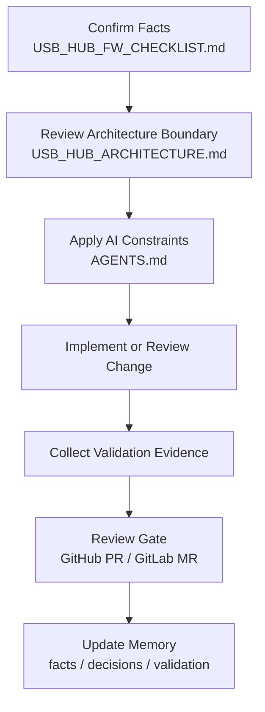

# USB Hub Firmware AI-Safe Architecture Contract

## 專案說明

本 repository 是一套提供給 `Keil C` / `Keil C51` 類型 `USB Hub firmware` 專案使用的治理與規格基線。

它不是 firmware SDK、USB stack implementation、build system，也不是可直接燒錄的 firmware codebase。  
它的定位是 documentation-first 的控制層，用來約束：

- firmware 設計
- architecture review
- AI 協作行為
- validation 要求
- project memory 維護

## 適用對象

本專案主要適用於：

- `Keil C` / `Keil C51` 韌體專案
- `8051` 或 enhanced `8051` 類型的 USB Hub firmware 環境
- 需要 AI 協助撰寫規格、做設計審查、或進行受控修改的團隊

## Governance Architecture Diagram

這張圖描述的不是 firmware module，而是整個 repository 的治理架構：

- facts / project truth 先定義不可猜測的事實
- architecture / system boundaries 定義不可跨越的邊界
- agents / AI constraints 約束 AI 行為
- traceability 串起 facts、rules、validation
- standard reference 只作為受控語意層
- escalation 與 fact preservation 用來處理衝突與避免 context loss
- workflow 與 review gate 把這些規則落到實際變更流程

## 核心文件

- [USB_HUB_FW_CHECKLIST.md](./USB_HUB_FW_CHECKLIST.md)：不可猜測的 project facts
- [USB_HUB_ARCHITECTURE.md](./USB_HUB_ARCHITECTURE.md)：architecture boundaries 與 safety rules
- [AGENTS.md](./AGENTS.md)：AI behavior constraints
- [WORKFLOW.md](./WORKFLOW.md)：GitHub / GitLab review workflow 與 hard stop conditions
- [TRACEABILITY_MATRIX.md](./TRACEABILITY_MATRIX.md)：facts、architecture、agent rules、validation 的追溯矩陣
- [USB_IF_INTEGRATION_PLAN.md](./USB_IF_INTEGRATION_PLAN.md)：USB-IF spec 僅作為 USB hub firmware 的受控 reference layer 導入方案
- [USB_HUB_CLASS_REQUESTS_REF.md](./USB_HUB_CLASS_REQUESTS_REF.md)：USB Hub class requests 的受控標準參考摘要
- [USB_HUB_PORT_STATUS_BITS_REF.md](./USB_HUB_PORT_STATUS_BITS_REF.md)：USB Hub port status / change semantics 的受控標準參考摘要
- [memory/README.md](./memory/README.md)：持久化 project context 的記憶層說明

## Governance Flow

這張圖只描述實際變更流程，對應的是：

`Facts -> Architecture -> Agent Constraints -> Implementation -> Validation -> Memory`

## Hard Stops

以下條件是阻斷條件，不是建議事項：

- Missing required facts -> stop implementation
- Architecture-sensitive change -> architecture review required
- Missing validation evidence for firmware-impacting changes -> stop merge

詳細規則請看：

- [WORKFLOW.md](./WORKFLOW.md)

## Technical Execution Constraints

以下是針對 `Keil C51` / `8051` / `USB Hub firmware` 的高風險執行限制：

- Interrupt Safety: `main` 與 `ISR` 共用的函式或狀態，必須明確處理 reentrancy 或共享保護。
- DPTR Guard: 若目標僅有單組 `DPTR`，則 ISR 內的 `xdata` 存取不得破壞主流程指標狀態。
- Atomic Event Handling: Port change / status change 類事件必須避免不安全的 clear-then-handle 寫法。
- Non-blocking Cross-Chip Access: Master/Slave 間的遠端通訊不得阻塞 USB 關鍵路徑，尤其不得塞進 ISR。

相關技術邊界請看：

- [USB_HUB_ARCHITECTURE.md](./USB_HUB_ARCHITECTURE.md)

## Quick Start

1. 先填 [USB_HUB_FW_CHECKLIST.md](./USB_HUB_FW_CHECKLIST.md) 中與本次變更直接相關的必要欄位。
2. 再看 [USB_HUB_ARCHITECTURE.md](./USB_HUB_ARCHITECTURE.md) 是否碰到 architecture boundary。
3. 用 [AGENTS.md](./AGENTS.md) 約束 AI 不得在缺乏事實時亂推論。
4. 用 [WORKFLOW.md](./WORKFLOW.md) 走 review gate。
5. 用 [TRACEABILITY_MATRIX.md](./TRACEABILITY_MATRIX.md) 確認 fact 與 rule 的對應關係。
6. 把已確認的 facts、decisions、validation evidence 更新到 [memory](./memory/README.md)。

## Review Gate

GitHub 與 GitLab 都有對應入口：

- [.github/PULL_REQUEST_TEMPLATE.md](./.github/PULL_REQUEST_TEMPLATE.md)
- [.gitlab/merge_request_templates/Default.md](./.gitlab/merge_request_templates/Default.md)

## 參考來源

本專案的 documentation-first 治理思路，有參考：

- <https://github.com/GavinWu672/ai-governance-framework>
