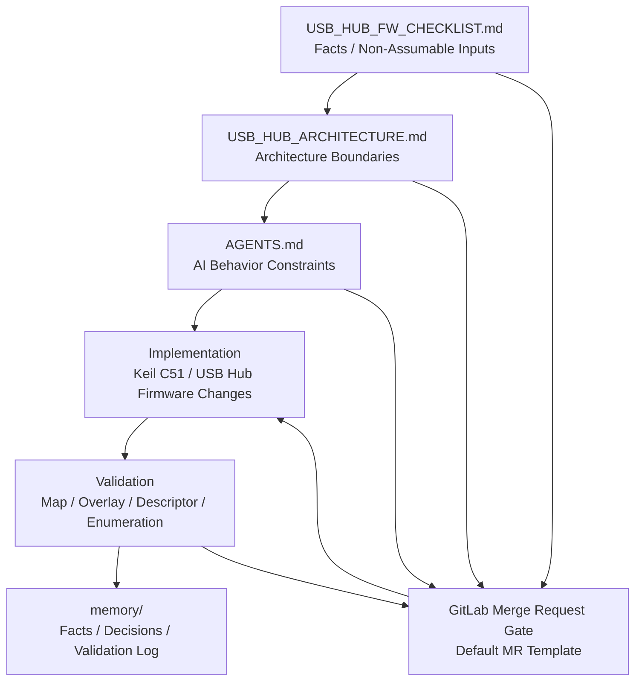

# USB Hub Firmware AI-Safe Architecture Contract

## 專案說明

本 repository 是一套提供給 `Keil C` / `Keil C51` 類型 `USB Hub firmware` 專案使用的治理與規格基線。

它的目的，是讓工程師與 AI coding agent 都依照同一份 contract 工作，明確知道：

- 韌體架構允許什麼
- 哪些事實不能猜
- 哪些安全邊界不能破壞
- 哪些專案事實必須先確認才能實作

這個專案本身不是 firmware 原始碼，而是偏向 documentation-first 的控制層，用來約束 firmware 設計、變更審查、AI 協作與規格管理。

## 主要適用對象

本專案主要適用於：

- `Keil C` / `Keil C51` 為主的韌體專案
- `8051` 或 enhanced `8051` 類型的 USB Hub firmware 環境
- 需要 AI 協助撰寫規格、做設計審查、或進行受控修改的團隊

## Repository 結構

- [AGENTS.md](/e:/BackUp/Git_EE/USB-Hub-Firmware-Architecture-Contract/AGENTS.md)：AI 治理規則與不可違反的安全限制
- [USB_HUB_ARCHITECTURE.md](/e:/BackUp/Git_EE/USB-Hub-Firmware-Architecture-Contract/USB_HUB_ARCHITECTURE.md)：USB Hub firmware 架構邊界、protocol 規則、flash safety、topology 原則
- [USB_HUB_FW_CHECKLIST.md](/e:/BackUp/Git_EE/USB-Hub-Firmware-Architecture-Contract/USB_HUB_FW_CHECKLIST.md)：專案事實清單，實作前必須先確認的欄位都放在這裡
- [WORKFLOW.md](/e:/BackUp/Git_EE/USB-Hub-Firmware-Architecture-Contract/WORKFLOW.md)：GitLab 工作環境下的 firmware governance workflow
- [TRACEABILITY_MATRIX.md](/e:/BackUp/Git_EE/USB-Hub-Firmware-Architecture-Contract/TRACEABILITY_MATRIX.md)：把 facts、architecture、agent rules、validation 串起來的追溯矩陣
- [memory/README.md](/e:/BackUp/Git_EE/USB-Hub-Firmware-Architecture-Contract/memory/README.md)：AI 協作時使用的持久化記憶層說明

## 使用方式

### 1. 先確認事實，不要先改程式

在改 firmware logic 之前，先填寫 [USB_HUB_FW_CHECKLIST.md](/e:/BackUp/Git_EE/USB-Hub-Firmware-Architecture-Contract/USB_HUB_FW_CHECKLIST.md) 裡的必要欄位。

高風險、不可猜的典型項目包括：

- oscillator frequency
- descriptor storage location
- hub topology
- flash execution region
- vendor command layout

如果必要事實還不知道，就應該先停下來確認，而不是讓 AI 或工程師自行推測。

### 2. 用 architecture 文件當安全邊界

[USB_HUB_ARCHITECTURE.md](/e:/BackUp/Git_EE/USB-Hub-Firmware-Architecture-Contract/USB_HUB_ARCHITECTURE.md) 用來定義哪些架構規則不能被破壞，尤其包含：

- cross-chip register access
- flash erase / write 執行限制
- protocol struct layout
- vendor command governance
- power / reset sequencing

### 3. 用 AGENTS 規範 AI 行為

[AGENTS.md](/e:/BackUp/Git_EE/USB-Hub-Firmware-Architecture-Contract/AGENTS.md) 是 AI 協作時的操作契約。

核心原則很簡單：

- 不知道的事實必須詢問，不能腦補

## Governance Flow

下面這張圖描述這個 repository 在 firmware 變更前後的治理流程：

這張圖對應的核心邏輯是：

- `USB_HUB_FW_CHECKLIST.md` 先定義不能猜的事實
- `USB_HUB_ARCHITECTURE.md` 定義不可跨越的架構邊界
- `AGENTS.md` 約束 AI 不得在缺乏事實時亂推論
- firmware 實作完成後必須帶著 validation evidence 進入 review
- 最後把事實、決策、驗證結果寫回 `memory/`

這套流程的目的，是降低 AI coding 在 firmware 領域最常見的風險：

- context loss
- hidden assumptions
- architecture violation
- incomplete validation

## Review Gate

在進行 firmware 修改之前，至少應先確認以下條件：

- `USB_HUB_FW_CHECKLIST.md` 中與本次變更直接相關的必要欄位已填寫
- `USB_HUB_ARCHITECTURE.md` 中相衝突的架構風險已審查
- `memory/02_project_facts.md` 已更新本次變更依賴的已確認事實

如果以上條件不成立，則不應直接進入 firmware code modification。

GitLab merge request 流程已對應到：

- [.gitlab/merge_request_templates/Default.md](/e:/BackUp/Git_EE/USB-Hub-Firmware-Architecture-Contract/.gitlab/merge_request_templates/Default.md)

## Memory Update Triggers

以下事件發生時，必須同步更新對應的 memory 檔案：

- Architecture change → `memory/03_decisions.md`
- Confirmed hardware fact → `memory/02_project_facts.md`
- Firmware validation result → `memory/04_validation_log.md`
- New vendor command definition → `memory/03_decisions.md`
- Scope or task shift → `memory/01_active_task.md`

如果 memory 沒有跟著更新，AI 與工程師在後續會話中就可能重新犯同樣的假設錯誤。

## Fact To Architecture Impact

下表用來說明 checklist 中的事實，會影響哪些 architecture 規則：

| Fact | Architecture Impact |
| --- | --- |
| Hub topology | Cross-chip access rules |
| Flash layout | Flash update guardrails |
| Descriptor location | Descriptor and protocol layout constraints |
| Vendor command location | Vendor command governance |
| Oscillator / clock source | Power-on sequencing and timing assumptions |
| Safe execution region | Flash erase/write execution rules |

## 參考 `ai-governance-framework`

本專案的設計方式有參考 [`GavinWu672/ai-governance-framework`](https://github.com/GavinWu672/ai-governance-framework) 的 documentation-first 治理思路。

就目前這個 USB Hub firmware spec 專案來看，最適合導入的功能是 `memory/` 機制。  
上游 repository 的 README 與 repo 結構有描述 `memory/` 目錄，以及用來維護記憶內容的流程概念。這個概念很適合拿來保存 firmware 專案裡那些不能反覆遺失的上下文。

參考來源：

- Source repository: <https://github.com/GavinWu672/ai-governance-framework>

### 為什麼 `memory/` 適合這個專案

因為 USB Hub firmware 工作很容易在不同會話中遺失關鍵上下文，例如：

- 已確認的 clock 與 descriptor 事實
- flash-safe execution 限制
- 已定義的 vendor command 規格
- cross-chip access 限制
- 已有的 validation 證據與未解決風險

所以 `memory/` 很適合作為這個專案的輕量導入功能。

### 目前實際導入了什麼

這個 repository 目前採用的是簡化版 `memory/` 模型：

- 用獨立 memory 檔案保存持久化專案事實
- 把 active work 與正式 architecture 規格分開
- 記錄 validation evidence 與未解決風險

目前沒有直接導入上游的 script、CI hook 或完整自動化流程，只採用 `memory` 這個概念本身。

## Memory 結構

[memory](/e:/BackUp/Git_EE/USB-Hub-Firmware-Architecture-Contract/memory/README.md) 目錄的用途，是保留 AI 與工程師都需要的持久化上下文。

- [00_master_plan.md](/e:/BackUp/Git_EE/USB-Hub-Firmware-Architecture-Contract/memory/00_master_plan.md)：專案目標、範圍、目前文件狀態
- [01_active_task.md](/e:/BackUp/Git_EE/USB-Hub-Firmware-Architecture-Contract/memory/01_active_task.md)：目前正在進行的工作與下一步
- [02_project_facts.md](/e:/BackUp/Git_EE/USB-Hub-Firmware-Architecture-Contract/memory/02_project_facts.md)：已確認、不能重新猜測的專案事實
- [03_decisions.md](/e:/BackUp/Git_EE/USB-Hub-Firmware-Architecture-Contract/memory/03_decisions.md)：架構決策與原因
- [04_validation_log.md](/e:/BackUp/Git_EE/USB-Hub-Firmware-Architecture-Contract/memory/04_validation_log.md)：驗證紀錄、已做的檢查、尚未補齊的證據

## 建議工作流程

1. 先填 `USB_HUB_FW_CHECKLIST.md` 的必要事實。
2. 把已確認的內容同步記到 `memory/02_project_facts.md`。
3. 把架構決策記到 `memory/03_decisions.md`。
4. 用 `USB_HUB_ARCHITECTURE.md` 當作實作邊界。
5. 完成 review、build、enumeration 檢查後，把證據記到 `memory/04_validation_log.md`。

## 這個 Repository 不是什麼

這個 repository 不是：

- firmware SDK
- USB stack implementation
- build system
- 可直接燒錄的 firmware codebase

它的定位是：

- governance contract
- architecture contract
- AI-safe firmware specification baseline

## 目前狀態

截至 2026 年 3 月 11 日，目前 repository 狀態如下：

- governance 規則已建立
- architecture spec 已建立
- project fact checklist 已建立
- memory 結構已初始化
- 真正的 firmware 專案事實仍未填完整

## 下一步建議

下一步最值得優先補齊的是這些高影響欄位：

- 實際 `.uvprojx` 檔名
- build target 名稱
- oscillator frequency
- descriptor storage location
- flash safe execution region
- 實際 hub topology
- vendor command protocol 文件位置

## License / 使用說明

目前這個 repository 只有專案文件。  
如果後續要直接導入外部治理框架的腳本、內容或模板，應先確認上游專案的授權與 attribution 要求。
